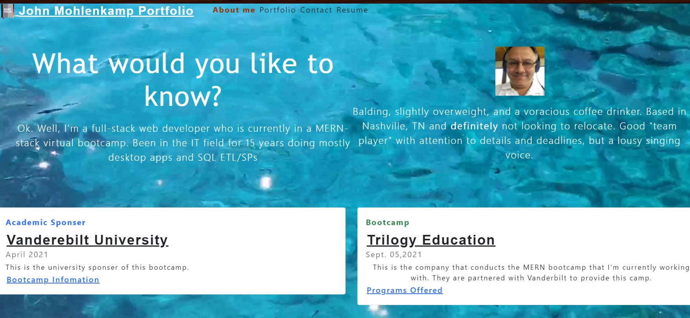

# Portfolio-SPA
Portfolio - Single Page Application

## John Mohlenkamp
## Sept 5, 2021

## GitHub Location: https://github.com/Mohlenkamp/portfolio-spa

## GitPages Location: https://mohlenkamp.github.io/portfolio-spa/

## Description 
This is the initial draft of my portfolio page. Using React to create an SPA, it will showcase six projects I've worked on during this bootcamp. I hope you enjoy it. I'll be changing/updating this as I get more comfortable/familiar with React.

p.s. Don't bother with trying to "tweet" me.. I only set that up as a requirement, but I'll not ever be checking it/using it.

Screenshot example of application:
